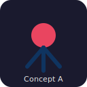

# SpiderFeet Widget

iFrame UI for **SpiderFeet** (OSINT automation). Embeds in the SpiderFeet host application and sibling surfaces via `postMessage`.

Licensed under **Apache-2.0** — Copyright Brett Forbes, 2026. See [LICENSE](LICENSE) and [NOTICE](NOTICE).

## Quick start

```bash
npm install
npm start
```

Or on Windows:

```powershell
.\start.ps1
```

Dev server: [http://localhost:4001](http://localhost:4001)

Production build:

```bash
npm run build
```

Output: `dist/index.html`, `dist/widget.js`, `dist/widget.css`, vendor bundles.

## Logo concepts (operator choice)

Same three provisional marks as the backend repo — select one in cross-repo issue **X-01-01**:

| Concept | Description | Preview |
|---------|-------------|---------|
| **A** | Minimal icon |  |
| **B** | Badge + wordmark |  |
| **C** | Wordmark underline |  |

The dev UI navbar uses **Concept B** as a placeholder until final logo selection.

## Where to add code

| Area | Path |
|------|------|
| HTML body (injected into shell) | `src/html/content.html` |
| Shell template | `src/html/_index.html` |
| Styles | `src/sass/content.scss`, `src/sass/custom.scss` |
| Widget JS | `src/js/app.js`, `src/js/_namespace.js` |
| Build config | `webpack.common.js`, `webpack.dev.js` |

See `src/html/README.md` and `src/js/README.md` for webpack/html-loader details.

## Multi-repo workspace

Use with `spiderfeet` (Python backend) in a Cursor multi-root workspace. Governance: `.governance/project/PROJECT_INTENT.md`.
